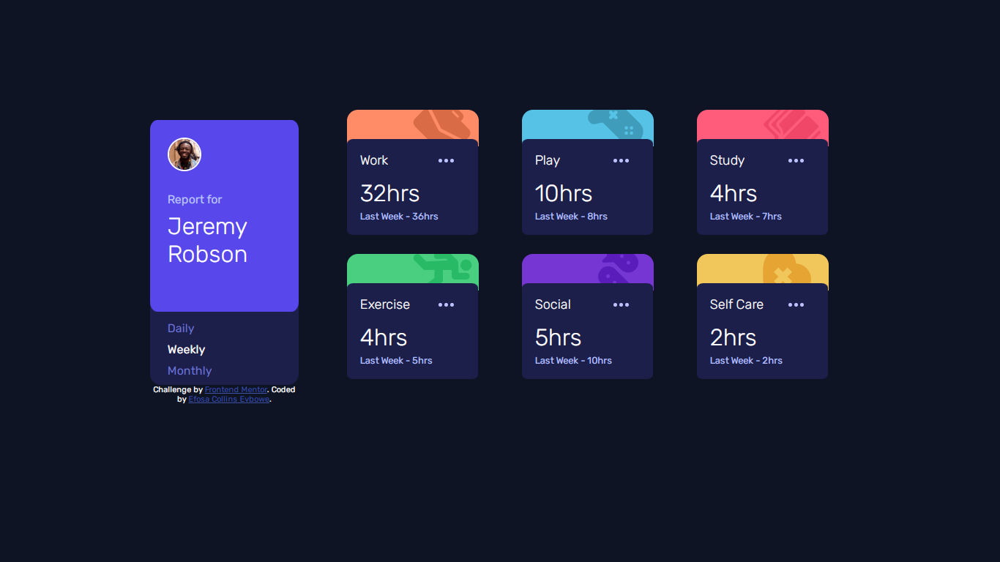

# Frontend Mentor - Time tracking dashboard solution

This is a solution to the [Time tracking dashboard challenge on Frontend Mentor](https://www.frontendmentor.io/challenges/time-tracking-dashboard-UIQ7167Jw). Frontend Mentor challenges help you improve your coding skills by building realistic projects.

## Table of contents

- [Overview](#overview)
  - [The challenge](#the-challenge)
  - [Screenshot](#screenshot)
  - [Links](#links)
- [My process](#my-process)
  - [Built with](#built-with)
  - [What I learned](#what-i-learned)
  - [Continued development](#continued-development)
- [Author](#author)
- [Acknowledgments](#acknowledgments)

## Overview

### The challenge

Users should be able to:

- View the optimal layout for the site depending on their device's screen size
- See hover states for all interactive elements on the page
- Switch between viewing Daily, Weekly, and Monthly stats

### Screenshot



### Links

- Solution URL: [Solution URL](https://your-solution-url.com)
- Live Site URL: [Live Site URL](https://your-live-site-url.com)

## My process

### Built with

- Semantic HTML5 markup
- CSS custom properties
- Flexbox
- CSS Grid
- Sass
- JavaScript

### What I learned

I started developing this site by reformating the given "index.html" file. I went on to list out the technologies I'll like to use and then identify carefully the correct CSS property that will fit each section. For this part, I came up with using CSS Grid together with a touch of Flexbox.

After writing the codes for all sections, a friend checked my code and saw that I could use JavaScript to recreate each section, I was totally ignorant about this because I didn't know how to use JSON yet. He taught me how to use JSON and that became the first time I worked on a project together with a fellow coder.

I basically learned how to use JSON and how to use CSS Grid together with Flexbox. You can try this out, I'm sure you'll have a beautiful outcome.

Developing the mobile section for the profile image and name was really tough for me. I finally decided to use the "float" hacks. Check code snippet below:

```css
#parent .user-info {
  position: relative;
  margin-bottom: 30px;
}

#parent .user-img {
  margin: 0 15px 0 0;
  float: left;
}

#parent .user p {
  position: inherit;
  top: 10px;
  margin-bottom: 3px;
}

  #parent .user-name {
  position: inherit;
  top: 15px;
}
```

### Continued development

I will continue working on projects that require me to use JSON or generally APIs so I won't have to write code repeatedly.
I'm currently learning React, Node.js, Express.js. Soon, I should do projects featuring one or more of these.

## Author

- Website - [Efosa Collins EVBOWE](https://efecollins.github.io/new-pweb/dist)
- Frontend Mentor - [efecollins](https://www.frontendmentor.io/profile/efecollins)
- Twitter - [EfeCollins7](https://www.twitter.com/efecollins7)
- Github - [efecollins](https://www.github.com/efecollins)

## Acknowledgments

I want to say a big THANK YOU to [Saviour](https://www.github.com/Saviourise). My friend who helped me in the JavaScript area of this project and also to FrontEnd Mentor for this free project and mentorship.